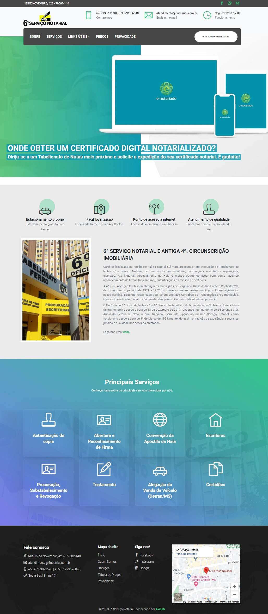

<h1>🚀 Projeto</h1> 
<dd>Site institucional de página única.</dd>
 

  

<h1>🛠️ Tecnologias utilizadas</h1> 
<ul>
    <li>Html</li>
    <li>CSS</li>
    <li>Javascript</li>
    <li>React</li>
    <li>Bootstrap</li>
</ul>

  

<h1>📃 Como utilizar</h1>

Para executar o projeto localmente utilize o comando <strong>npm start</strong>

Abrir <em>[http://localhost:3000](http://localhost:3000)</em> para visualizar no navegador.

A página irá atualizar a cada alteração, você poderá visualizar qualquer erro no console F12.

  

<h3>Feito com ❤️ por <a url="https://www.linkedin.com/in/felipeteixeirams/" target="_blank">Felipe Teixeira</a>.</h3>